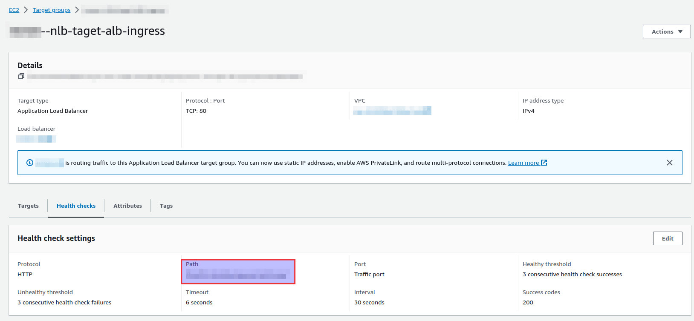

# K8s Health Check Container

This is a dummy container for a complex problem... when deploy an application
on EKS using URL sub-domains to route requests to specific name spaces, AWS
is not possible to reach health-check URLs when using Network Load Balancer
with Application Load Balancer as EKS ingress.

This container can be deployed at a health-check name space, and act as
a cluster health-check.

## Usage
Container will always return 'health check ok' with status 200 at
`HEALTH_CHECK_PATH` environment variable path. **DO NOT USE / AT THE START OF
THE PATH** (sorry for yelling...).

## Example of ALB ingress with K8s Health Check Container
```yml
kind: Pod
apiVersion: v1
metadata:
  name: healthcheck-app-pod
  namespace: healthcheck
  labels:
    app: healthcheck
spec:
  containers:
    - name: healthcheck
      image: andrebaceti/k8s-health-check-container:0.1
      env:
      - name: HEALTH_CHECK_PATH
        value: "k8s-cluster/health-check/"
---
apiVersion : "v1"
kind: Service
metadata:
  name: healthcheck-app-srv
spec:
  type: ClusterIP
  ports:
    - port: 80
      targetPort: 80
  selector:
      app: healthcheck
---
apiVersion: networking.k8s.io/v1
kind: Ingress
metadata:
  name: alb-ingress
  namespace: dev
  annotations:
    kubernetes.io/ingress.class: alb
    alb.ingress.kubernetes.io/load-balancer-name: 'nice-alb-ingress'
    alb.ingress.kubernetes.io/group.name: 'api-gateway'
    alb.ingress.kubernetes.io/ip-address-type: ipv4
    alb.ingress.kubernetes.io/scheme: internal
    alb.ingress.kubernetes.io/target-type: ip
    alb.ingress.kubernetes.io/listen-ports: '[{"HTTP": 80}'
    alb.ingress.kubernetes.io/healthcheck-path: '/k8s-cluster/health-check/'
spec:
  rules:
  - http:
      paths:
      - pathType: Prefix
        path: "/k8s-cluster/health-check/"
        backend:
          service:
            name: healthcheck-app-srv
            port:
              number: 80
```

This container can be used to deploy the health check used for the
Network Load Balancer.


